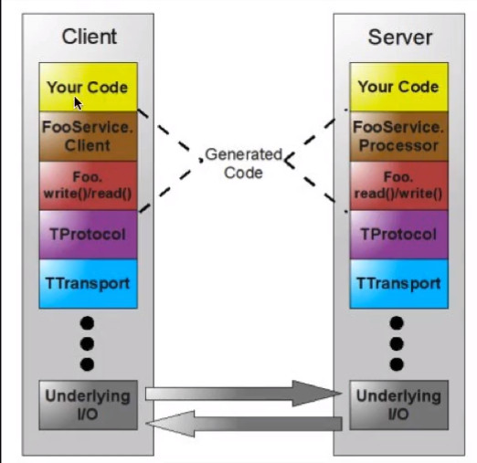

# netty 4 基础到提升（视频 ：https://www.bilibili.com/video/av33707223/?p=32）

##步骤
  1. 创建服务器
  2. 自定义initializer
  3. 自定义handler

## 需求

### 1、聊天程序

* 建立连接
* 消息广播
### 2、心跳机制（定时）
* 集群之间的长链接
* 节点之间 最终最终一致性。
* 节点间通信：
* 例如  手机 飞行模式或者强制关机 是不会调用此方法
     *  针对这种情况必须有心跳机制
### 3、RPC
### 4、请求http


# webSocket （伴随着h5提出）
## http协议
* 无状态的（cookie和Session解决这些问题）
* http1.0 只能客户端发起请求
* http1.1 keeplive  客户端和服务器端可以保持一点时间的连接（建立短暂链接）

问题：<hr>
    1. http 无法基于浏览器聊天<br/>
    2. 服务器端的推技术（http协议禁止推技术）（解决方案：轮训、commit（无法实时消息推送））<br/>
    * 轮训，大部分的请求没有结果，浪费资源 <br/>
    * 头信息占带宽
## websocket（html5 技术）
1. 长链接
2. 节省网络带宽（只发送有用的信息）
3. 构建在http之上的协议（websocket基于http 升级）
4. 需要服务端对websocket支持
5. 缺少心跳机制，就是无法感知传输连接
    
## 需求

###1、index.html 实现websocket 

## RPC 

### 简介 RMI（Remote method invocation，远程方法调用）---只针对java

client：（反序列化 字节码）---》调用服务端方法（字节码）  stub（桩）<br/>
server：（反序列化 字节码）---》字节码返回客户端   skeleton（骨架）<br/>

序列化和反徐序列化 ：编码和解码 <br/>

### RPC (Remote Procedure Call:远程过程调用) --- 跨语言的---基于Socket

1. 定义接口说明文件：描述了对象（结构体）、对象成员、接口方法等一系列信息
2. 通过RPC框架所提供的编译器，将接口说明文件编译成具体语言文件
3. 在客户端和服务端分别引入RPC 编译所生成的文件，即可以向调用本地方法一样调用远端方法。

应用场景：<br/>
    内网服务间调用建议使用RPC 调用，调高效率。
优势：<br/>
    高效的远程调用
    跨平台，跨语言调用

### WebService  ---基于hTTP 效率低一点


## protobuf (序列化框架，平台中立，语言中立)

### 安装 配置
1、下载安装配置环境（https://github.com/protocolbuffers/protobuf）
2、官网 https://developers.google.cn/protocol-buffers/ 

### 生成类（不要修改）
```shell
--坚决不要修改生成的文件
$ protoc --java_out=src/main/java src/main/resources/protobuf/Student.proto
```
### 注意
1、handler的名称定义不能重名
### 当传递的消息类型有多重时，如何区分消息类型（ pipeline.addLast("protobufDecoder",new ProtobufDecoder(MyDataInfo.Person.getDefaultInstance()));）
1、自定义消息类型（自定义解码器）--较为复杂，主要是netty的自定义协议
2、嵌套在最外层消息类型，通过枚举判断

## Thrift （RPC 间调用）

### 简介
官网 http://thrift.apache.org/

使用Socket 通信

### 生成类（客户端发启请求-TCP -服务端返回结果-TCP-客户端接收结果）

```shell
-- 生成类 data.thrift(接口描述语言)
$ thrift --gen java src/main/resources/thrift/data.thrift
```
### 实例 service and Client (选型，并发量非常大)

使用场景：<br/>
    * 大数据
    * 异构语言的平台调用
TCompactProtocol（压缩协议） ->TFramedTransport（以帧传输方式，非阻塞）->THsHaServer（半同步半异步的服务模型）
### 原理介绍
#### 架构图


#### 网络七层协议


#### Thrift 传输协议


#### Thrift 传输方式


#### Thrift 服务模型


### 实战 python  客户端 ，java 服务端 （官网：https://www.python.org/）
1. 生成 python 代码
```sbtshell
$ thrift --gen py src/main/resources/thrift/data-py.thrift
```
## GRPC（跳过）

### 特点

## IO(输入/输出)

1.节点流：（输入和输出流）
2.过滤流 ： 包装流


<hr/>

### 装饰模式（角色+作用）
1、对客户端透明
2、对对象包装
3、扩展透明


volatile ：内存可见性（多线程），保证编译的代码顺序一致性。保证有序性和可见性

## NIO开始


### IO（java.io）和NIO(java.nio)的区别

```china
java.io中最核心的概念是流（Stream），面向流的编程。Java中流，要不是输入流，或者是输出流。不可能同时即使输入流又是输出流。
java.nio中拥有3个核心概念：Selector，Channel与Buffer。在Java.nio 中，我们是面向块（block）或者缓冲区编程的。Buffer本身就是一块内存，底层
实现上，就是数组。数据的读取/写入都是通过Buffer实现的。

除了数组之外，Buffer还提供了对数组的结构化访问方式，并且可以追踪到系统的读写过程

Java的7种原生数据类型都有各自的Buffer类型，如IntBuffer，LongBuffer,ByteBuffer and CharBuffer等,没有BooleanBuffer

Channel指的是可以向其写入数据或者可以从其读出数据的对象，类似于Java中的Stream。
所有数据的读写都是通过Buffer完成的，永远不会出现从Channel中读取数据或者写入数据的情况。

与Stream不同的是，Channel是双向的，一个Stream只有可能是InputStream或者OutputStream。Channel打开后则可以进行读取/写入和读写
因为Channel是双向的，所有可以更好的反应底层操作系统的真是情况。在Linux中，底层操作系统就是双向的

Buffer 的三个重要属性： capacity, limit, and position (capacity>=limit>=position>=mark>=0 )
    capacity ： 容器的大小，永远不会为负数，永远不会改变。
    limit: 将要会读或者写的下一个索引
    position: 永远不会变化，索引位置（下一个将被读写的元素位置）

     <p> A buffer's <i>capacity</i> is the number of elements it contains.  The
     capacity of a buffer is never negative and never changes.  </p>
     <p> A buffer's <i>limit</i> is the index of the first element that should
     not be read or written.  A buffer's limit is never negative and is never
     greater than its capacity.  </p>
     <p> A buffer's <i>position</i> is the index of the next element to be
     read or written.  A buffer's position is never negative and is never
     greater than its limit.  </p>

flip : 改变了limit和position 的位置

Every buffer is readable, but not every buffer is writable
```

### Java内存模型（JNI）

    堆外内存:在堆之外创建了一个空间（直接以系统ＩＯ交互）－－零拷贝
    java堆内存->（native堆）->IO设备  （出现了多次拷贝）
    DirectBuffer（address）-》堆外内存（直接内存）-》IO （零拷贝）  （java虚拟机可以直接进行本地的IO操作）
   
GC： 内存压缩  ---》可以存储更大的对
内存拷贝：不会产生GC
Netty 就使用了IO零拷贝

### 网络编程模型

#### 传统阻塞式IO编程

1.服务端
        
     1、ServerSocket serverSocket = 
     2、serverSocket.bind(int port)
     3、while(true){
            Socket socket = serverSocket.accept();//阻塞方法
            new Thread(socket);
            run(){
                socket.getInputStream()
                ...
                ...
                ...
            }
        }
     
 2.客户端
 
     1、Socket socket = new Socket("localhost",port);   //port只是服务端和客户端的链接端口，通信端口是服务端随机分配
     2、socket.connect();

 3.缺点：
 
     1、无法满足多个线程访问（并发）
     
#### Nio 非阻塞编程（异步）--- 基于事件

    selector：选择器
    event ：事件（核心）
    
#### Nio 零拷贝（操作系统提供的）
##### 传统意义上的额IO


传统的IO（4次）
写入：用户空间<-内核空间<-硬盘
写出：用户空间->内核空间->硬盘

##### 系统意义上的额IO

硬盘->内存空间->内存空间拷贝->用户空间

##### 真正的零拷贝

硬盘->内存空间->内存空间拷贝->用户空间

## Netty源代码分析

###价值
分析源码的原理和价值-实现逻辑

###Reactor模式原理（reactor总共有5种角色构成角色）
* Handle(句柄)--事件产生的发源地
    本质上是一种资源，是由操作系统提供，该资源用于表示一个一个的事件，事件既可以来自于内部也可以来自于外部。
    外部事件：客户端的连接请求
    内部事件：操作系统定义的定时器等
    本质：文件描述符，Handle事件产生的发源地
* Synchronous Event Demultiplexer（同步事件分离器）
    本身是系统调用，用于等待事件发生（事件可以是一个，也可以是多个），调用方调用它的时会被阻塞，一致阻塞到同步分离器上有事件产生为止，对Linux而言，
    同步事件分离器指的就是常用的IO多路复用机制，比如select、poll、epoll等，在Java Nio中，同步事件分离器对应的组件就是Selector。对应的阻塞
    方法就是select()
    
* Event Handler(事件处理器)：本身由多个回调方法组成，这些回调方法构成了与应用相关的对应的某个事件的反馈机制。 Netty相比于Java Nio 在事件处理
    器角色上就升级，它为我们开发者提供了大量的回调方法，供我们在特定事件产生时实现相应的回调方法进行业务逻辑处理回调。
* Concrete Event Handler（具体事件处理器）：是事件处理器的实现。它本身实现了事件处理器所提供的回调方法，从而实现了特定业务的逻辑。他本质上就是
    我们所编写的一个个的处理器实现。
* Initiation Dispatcher（初始分发器）：实际上就是Reactor角色，它本身定义了一个规范，这些规范用于控制时间的调度方式，同时又提供了应用进行事件
    处理器的注册，删除等设施。它本身是整个事件处理器的核心，Initiation Dispatcher会通过同步事件分离器等待事件发生。一旦事件发生，Initiation 
    Dispatcher 首先会分理处每一个事件，然后调用事件处理器，最后调用相关的回调方法来处理这些事件。

###Reactor模式流程
1. 当应用向Initiation Dispatcher注册具体的实践处理器时，应用会标识出该事件处理器希望Initiation Dispatcher在某个事件发生的时候向其通知该
    事件，该事件向handle关联
2. Initiation Dispatcher会要求每一个事件处理器向其传递内部的Handle。该handle向操作系统标识事件处理器。
3. 当所有的事件处理器注册完毕后，应用会调用handle_events方法来启动Initiation Dispatcher的事件循环。这时Initiation Dispatcher将每个注册
    事件管理器的Handle合并起来，并使用同步事件问题器等待这些事件的发生。比如，TCp协议层会使用select同步事件分离器操作来等待客户端发送的数据到达
    来接的socket handle上
4. 当与某个事件源对应的handle变为ready状态时（比如，TCP socket 变为等待状态时），同步事件分离器就会通知Initiation Dispatcher。
5. Initiation Dispatcher 会触发事件处理器的回调方法，从而响应这个处于ready状态的handle。当事件发生时，Initiation Dispatcher会将被事件
    源激活的handle作为【key】来寻找并分发恰当的事件处理器回调方法。
6. Initiation Dispatcher 会回调事件处理器的handle_events回调方法来执行特定于应用的功能（开发者自己编写的功能），从而响应这个事件。所发生的
    事件类型可以作为该方法的参数并被该方法内部使用。来执行额外的特定于服务的分离和分发。

### Channel 、ChannelHandlerContext、ChannelHandler关系
1. ChannelPipeline ：容器 ,其中存储ChannelHandlerContext，ChannelHandlerContext中存放的ChannelHandler和Channel。
2. ChannelHandlerContext是一个桥梁连接Channel和ChannelHandler。

### NioServerSocketChannel、ServerSocketChannelConfig
###EventLoopGroup和Thread 线程问题
1. 一个EventLoopGroup当中会包含一个或者多个EventLoop。
2. 一个EventLoop在它的整个生命周期中都只会与唯一的一个Thread进行绑定。
3. 所有由EventLoop所处理的各种I/O事件都将在它所关联的那个Thread上进行处理。
4. 一个Channel在它的整个生命周期中指挥注册一个EventLoop。
5. 一个EventLoop在运行过程中，当被分配给一个或者多个channel。

note：<br/>
1. channel本质是单线程的，不要在handler中做耗时操作。因此不需要同步。
2. 同一个channel提交和执行的顺序是一致的。
3. channel一定是线程安全的。
重要结论1:<br/>
在netty中，Channel的实现一定是线程安全的，基于此我们可以存储一个channel引用，并且在需要向远端发送数据时，通过这个应用调用channel的相关方法；
即便当时有很多线程在使用它也不会出现d多线程问题，而且消息一定是a按照顺序发出去。
重要结论2:<br/>
我们在进行业务开发的时候，不要将长时间的耗时任务放到EventLoopd的致性队列中，因为它将会一致阻塞该线程对应的所有Channel上的其他任务，如果我们需要
进行阻塞调用或者耗时操作时（实际业务开发中）。那么我们就需要使用一个专门的EventExecutor(业务线程池)。
通常有两种实现方式:<br/>
1. 在ChannelHandler的回调方法中，使用自己定义的业务线程池，这样就可以实现异步调用；
2. 借助于netty提供的向ChannelPipeline添加ChannelHandler时调用addLast方法来传递EventExecutor。

note：<br/>
默认情况下（调用addLast(handler)）,channelHandler中的回调方法都是由I/O线程所执行，如果调用了
ChannelPipeline addLast(EventExecutorGroup group, ChannelHandler... handlers)；方法，那么ChannelHandler中的回调方法就是由参数中
的group线程组来执行的。
### 初始化和注册流程 （）

### JDK Future 和 Netty Future 关系
JDK所提供的Future只能通过手动方式检测执行结果，而这个操作时阻塞的；Netty则是对ChannelFuture进行的增强，通过ChannelFutureListener以回调的
方式获取执行结果，去除手动检测阻塞的操作；只得注意的是：ChannelFutureListener的operateComplete方式是由I/O线程执行的，因此要注意的是不要在
这里执行耗时操作，否则需要通过另外的线程或者线程池来执行。
### Netty的两种消息发送方式
在Netty 中由两种发送消息的方式，可以直接写到Channel中，也可以写到与ChannelHandler所关联的那个ChannelHandlerContext中。对于前一种方式来说，
消息会从ChannelPipeline的末尾开始流动，对于后一种来说，消息将从ChannelPipeline中的下一个ChannelHandler开始流动；

结论：
    1. ChannelHandlerContext与ChannelHandler之间的关联关系是永远都不会发生改变的，因此对其进行缓存是没有任何问题的。
    2.对于与Channel的同名方法来说，ChannelHandlerContext的方法将会产生更短的事件流，所以我们应该在可能的情况下利用这一特性提升应用性能。
    
### 一个服务端同时又有客户端的能力


### ByteBuf
注意： 通过索引来访问Byte时并不会改变真实d的都索引与写索引；我们可以直接通过ByteBuf的readerIndex() 与writerIndex()方法分别直接修改读索引与写索引

#### ByteBuf 三种缓冲区类型
1. heap buffer（堆缓冲区）。
2. direct buffer（直接缓冲区）。
3. composite buffer(混合缓冲区)。


<pre>
Heap Buffer(堆缓冲区)
    这是最常用的类型，ByteBuf将数据存储到JVMd的堆空间中，并且将实际的数据存储到Byte array中实现
    优点：
        由于数据存储在JVM的堆中，因此可以快速的创建与快速的释放，并且它提供了直接访问内部字节数组的方法。
    缺点：
        每次读写数据时，都需要先将数据复制到缓冲区中再进行网络传输。

Direct Buffer(直接缓冲区)
    在堆之外直接分配内存空间，直接缓冲区并不会占用堆的容量空间，因为它是由操作系统在本地内存进行的数据分配。
    优点：
        在使用Socket进行数据传递时，性能非常好。因为数据直接位于操作系统的本地内存中，所以不需要从JVM将数据复制到直接缓冲区中，性能很好。 
    缺点：
        因为Direct Buffer 是直接在操作系统内存中的，所以内存空间的分配与释放要比堆空间更加复杂，而且速度更慢一些。
 Netty通过提供内存池来解决这个问题，直接缓冲区并不支持通过字节数组的方式来访问数据。
 重点：对于后端的业务消息的编解码来说，推荐使用HeapByteBuf；对于I/O通信线程在读写缓冲区时，推荐使用DirectBuf。

Composite Buffer(复合缓冲区)

JDK的ByteBuffer与Netty的ByteBuf之间的差异：
    1.Nettyd的ByeBuf采用的时读写分离的策略（readerIndex，writerIndex）一个初始化（里面尚未有任何数据）的ByteBuf的readerIndex与WriterIndex
    值都为0.
    2.当读索引和写索引处于同一个位置是时，如果我们继续读取，那么就会抛出IndexOutOfBoundsException.
    3.对于ByteBuf的任何读写操作都会分别单独维护读索引和写索引。maxCapacity最大容量默认的限制就是Integer.MAX_VALUE.

JDK的ByteBuffer的缺点：
    1. final byte[] hb; 这是JDK的ByteBuffer对象中用于存储数据的对象声明；可以看到，其字节数组是被声明为final的，也就是长度是固定不变的。一旦
    分配好就不能动态分配和收缩；而且当存储的数据字节很大时就很有可能出现IndexOutOfBoundsException。如果要预防这个异常，那就需要在存储之前完全
    确定好待存储的字节大小。如果ByteBuffer的空间不足，我们只有一种解决方案；创建一个全新的ByteBuffer对象，然后再将之前的ByteBuffer中的数据
    复制过去，这一切都需要开发者自己手动完成。
    2.ByteBuffer只使用了一个position指针来标记位置信息，在进行读取切换时就需要调用flip()方法或者rewind()方法,使用很不方便
    
 Netty的ByteBuf的优点：
    1.存储字节的数组是动态的；其最大值默认是Integer.MAX_VALUE。这里的动态性是体现在write()方法中，write()方法在执行时会判断buffer容量，如果
    不足则会自动扩容。
    2.ByteBuf读写索引是完全分开的，使用起来是很方便的。
 自旋锁：由自己占用CPU资源。
 
 AtomicIntegerFieldUpdater要点总结：
    1.更新器更新的必须是int类型的变量，不能是其包装类型。
    2.更新器更新的必须是volatile类型变量，确保线程之间共享变量时的立即可见性（防止指令重排序）。
    3.变量不能时static的，必须是实例变量。因为Unsafe.objectFieldOffset()方法不支持静态变量（CAS操作本质上是通过对象实例的偏移量来直接进行赋值操作）
    4.更新器只能修改其可见范围内的变量，因为更新器是通过反射来得到这个变量的，如果变量不可见就会报错。
    
    如果要更新的变量是包装类型，那么可以使用AtomicreferenceFieldUpdater来进行更新
</pre>
#### Netty 处理器
<pre>
Netty 处理器重要概念：
    1.Netty的处理器可以分为两类：入站处理器和出战处理器。
    2.入站处理器的顶层是ChannelInboundHandler,出站处理器的顶层是ChannelOutboundHandler.
    3.数据处理时常用的各种编解码器本质上都是处理器
    4.编解码器：无论我们向网络中写入的数据是什么类型（int，char,String,二进制等），数据在网络中传递时，其都是以字节流的形式呈现的。将数据由原本的
    形式转换为字节流的操作成为编码（encode），将数据由字节转换为它原本的格式或其他格式的操作称为解码（decode）编解码统一称为codec。
    5.编码：本质上是一种出站处理器，因此编码一定是一种ChannelInboundHandler。
    6.解码：本质上是一种入栈处理器，因此解码一定是一种ChannelOutboundHandler。
    7.在Netty中，编码器通常以XXXEncoder命名，解码器通常以XXXDecoder命名。

TCP粘包和拆包

关于Netty编解码器的重要理论
    1.无论是编码器还是解码器，其所接收的消息必须与待处理的参数消息类型一致，否者该编码器或者解码器就不会执行。
    2.在解码器在进行数据解码时，一定要记住判断缓冲（byteBuf）中的数据是否足够，否则将会产生问题。
</pre>

#### Netty 粘包和拆包
<pre>
    package com.spring.netty.handler2
</pre>
#### 自定义协议（解决粘包和拆包）
com.spring.netty.userdefined.protocol
## Java NIO

### 使用NIO进行文件读取所涉及的步骤：
1.从FileInputStream对象获取到Channel对象
2.创建Buffer
3.将数据从Channel中读取到Buffer对象中。

### 基本方法
<pre>
1. 0 <=mark <= position <= limit <= capacity
2. flip()方法
    (1)将limit值设为当前的position
    (2)将position设置为0
3.clear() 方法
    (1)将limit值设置为capacity。
    (2)将position值设置为0
4.compact() 压缩方法
    (1)将所有的未读数据复制到buffer起始位置处。
    (2)将position设置为最后一个未读元素的后面。
    (3)将limit设置为capacity。
    (4)现在buffer就准备好了，但是不会覆盖未读的数据。
</pre>
[Java NIO中，关于DirectBuffer，HeapBuffer的疑问？](https://www.zhihu.com/question/57374068) 

